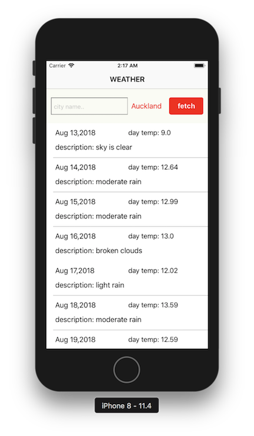
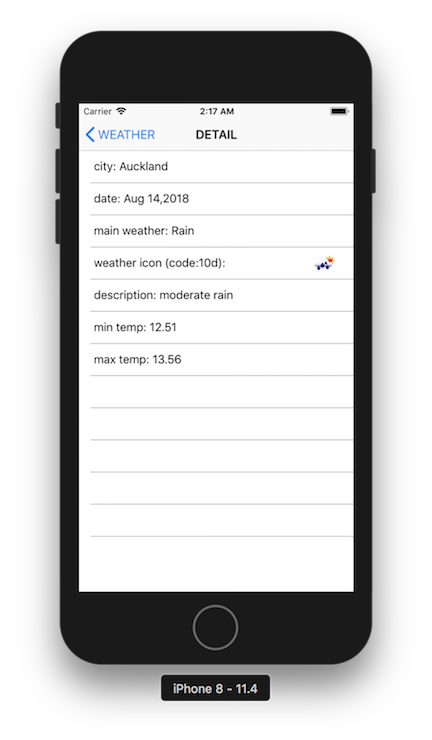

# YAWA-Demo

### Note
> This is a demo project in Swift which show weather infomation of specific cities.

### Service
> OpenWeatherMap API: https://openweathermap.org/api
>
> API Key Error: https://openweathermap.org/faq#error401

### Development Environment
> Xcode Version 9.4
>
> Apple Swift version 4.1.2

### TODO
> Covert weather icon code to image
>
> Architecture improvement

### Pages

